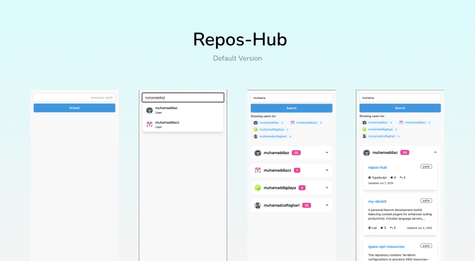
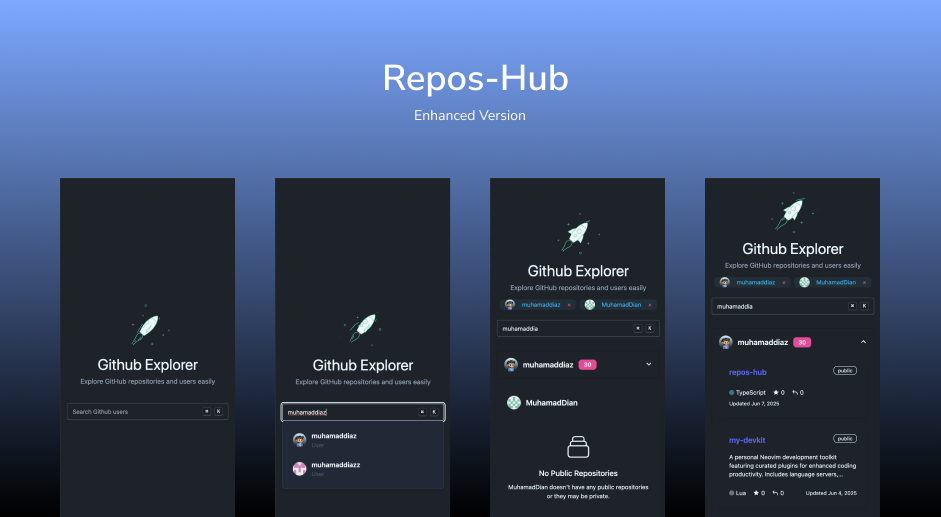

# 🔍 Repos-Hub

This project implements **two solutions** with slightly different UX and codebase structure, but both share the same objective:  
**🔎 Search and display GitHub repositories by username.**

[📚 How to Run](EXPLANATION.md)

---
## ✨ Features

- ⚛️ Built with **React**
- 🟦 Written in **TypeScript**
- 🧰 Extensible: You may use libraries of your choice for forms, styling, state management, and testing
- 🌐 Publicly hosted (e.g. via GitHub Pages)
- 📂 Open-source (available as a public GitHub repository)
- 📄 Proper **README** included
- ❗ Graceful error handling
- ⌨️ Good UX: keyboard navigation, loading states
- 🌍 Language: **English only**

---

## 🧪 Implemented Solutions

### ✅ Default Version
[🌐 Default App](https://muhamaddiaz.github.io/repos-hub/default/)

This base version meets the core functional requirements of the task.

#### 🔁 Flow:
search input → select username (up to 5 suggestions) → click “Search” → view repositories

---

### 💡 Enhanced Version
[🌐 Enhanced App](https://muhamaddiaz.github.io/repos-hub/enhanced/)

Same functionality as the default version but with a more polished UX and cleaner code structure.

#### 🔁 Flow:
search input → select username → view repositories

#### 🧠 Enhancements:
- 💾 **Persistent data** (remembers previous selections)
- 🌙 **Dark mode**
- ⚡ **Smooth loading & transition effects**

